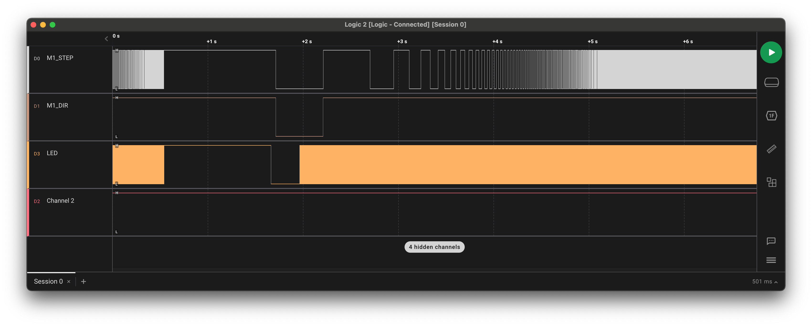

# STM32 Steppers Lib
C Library for driving multiple steppers 

## Overview

`config` – provides motors parametrs and STM Pin abstraction

`stepper` – implements single stepper workflow based on identity structure `StepperState`

`steppers_control` – implements synchronous control of steppers via timer  

## Flow

After major fix in control method, acceleration prosses works propertly (see pic bellow, where LED denotes TIM2 interrupt).

 

## ToDo
- [ ] Check transformation conftants
- [ ] Check accelerations
- [ ] Rewrite `config.c`